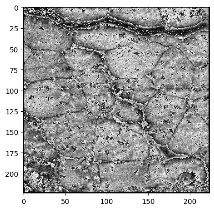
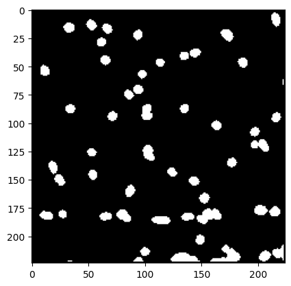
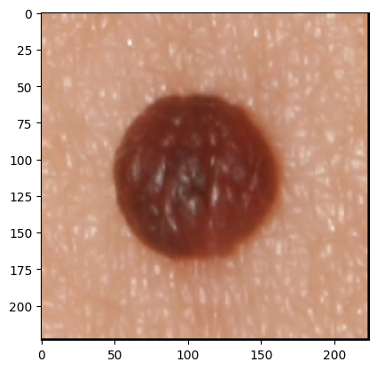
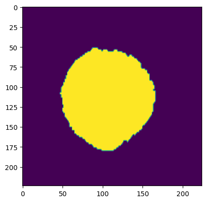

# SSL4MedImg

This repo is adapted from [Semi-supervised Learning for Medical Image Segmentation (SSL4MIS)](https://github.com/HiLab-git/SSL4MIS/tree/master/code) that implements the [*Cross Teaching Between CNN and Transformer*'s](https://openreview.net/forum?id=KUmlnqHrAbE)[3] application to three different datasets listed below. 

# Data 
We currently support three datasets listed below: 


### Dermatomyositis 
This is a private dataset [Van Buren et al.] [[2]] of autoimmunity biopsies of 198 samples, each contains 8 slices, produced by different coloring materials. Each slice has size 1408 × 1876. Our work uses the first slide from TIFF images, i.e. a DAPI-stained image for segmentation. 

Below shows visualizations of the dataset's image and mask respectively.

<p align="middle">
  
   
</p>


### Dermofit
This is a paid dataset sourced by the University of Edinburgh, and it contains 1,300 samples of high quality skin lesions, each with different sizes.[[1]]

Below shows visualizations of the dataset's image and mask respectively.


<p align="middle">
  
   
</p>

### ISIC-2017
This is a collection of 2000 lesion images in JPEG format and 2000 corresponding superpixel masks in PNG format, with EXIF data stripped. For retrieval of data, please download the raw data (including train, validation and test sets) from [ISIC Challenge Dataset](https://challenge.isic-archive.com/data/#2017) using `wget` and save the data into `../dataset/ISIC2017/original_data` folder. The visualization is similar to that of Dermofit.


# Preprocessing and folder structures

Image pre-processing is a pre-requisite step that is different from dataloder's image augmentations. See branch `code_version` in `Image_Preprocessing` folder for details of pre-processing. Specifically, in previous experiments we utilized interpolation/tiling method to process all raw images/label sets into size 480,480. Different pre-processing method was described in code_version/image_preprocessing/Segmentation_APP*. with no suffix indicates Dermatomyositis dataset. Details can be found in the manuscript.

To make sure the training procedure to be as smoothly as possible, we advise to structure the `dataset/` folder as follows, following the naming convention described below.

```
root - 
    |- SSL4MedImg
        |- code
            |- train_CT_between_cnn_transformer_2D.py
            |- ...
        |- environment.yml
        |- README.md
        |- ....
    |- dataset
        |- Dermatomyositis
            |- original_data
                |- CD27_Panel_Component
                |- Labels
            |- tile_image
            |- tile_label
            |- interpolated_image
            |- interpolated_label
        |- Dermofit
            |- original_data
                |- Ak 
                |- ...
            |- tile_image
            |- tile_label
            |- interpolated_image
            |- interpolated_label
        |- ISIC2017
            |- original_data
                |- ISIC-2017_Training_Data
                |- ...
            |- tile_image
            |- tile_label
            |- interpolated_image
            |- interpolated_label
```
# Install 

1. Clone the repo:

    ```
    git clone https://github.com/HiLab-git/SSL4MedImg.git
    cd SSL4MedImg
    ```

2. Environmental installation：

    Please make sure your Singularity Overlays still have more than 13GB capacity (We used 50GB singularity supported by NYU), and run the code below:
    ```
    conda env create -f environment.yml
    ``` 
    After running code, You will get a conda environment named `ssl`, all the required packages of this repo will be installed. 

3. Check points for the pretrained Swin-transformer:

    Please download pretrained check points from https://drive.google.com/drive/folders/1UC3XOoezeum0uck4KBVGa8osahs6rKUY and put it int `code/pretrained_ckpt/` directory.

# Usage:
The overall routine of the training/testing procedure are as follows: 

## Step1: Download data

    Please download, process, and put the data in 
    
    `../dataset/Dermatomyositis`, 
    `../dataset/Dermofit`, and  
    `../dataset/ISIC2017` folder. 

## Step2: Train the model(change setting based on specific args)

```
cd code
python train_CT_between_cnn_transformer_2D.py.py 
        --exp=${save_path}
        --labeled_num=${label_num} 
        --data_class=${data_class}
        --labeled_bs=${labeled_bs}
        --seed=${seed}
```

- `exp` is the saved directory path for saving model records
- `labeled_num` controls the percentage of labeled data used within the training set, with format 'xxp', p indicates percentage. (for instance, if one wants 30% of training data to be labeled, then use `--labeled_num 30p`, or if one want a specific number of labeled training samples, one should utilize the `patient_to_slice()` method to input desired number of labeled samples)
- `labeled_bs` is the batch size, it sets default to be 16. 
- `seed` indicates which random seed to be used in training. We averaged seeds `73, 211, 1234`.
- `data_class` indicates which dataset to be used. Since we generated both the interpolated and tiling version of each dataset, after experiments, we retained the following options:
    - `1`: interpolatd Dermofit dataset
    - `2`: tiled Dermatomyositis dataset
    - `3`: interpolatd Dermatomyositis dataset
    - `4`: interpolatd ISIC2017 dataset
 - model is saved based on the criterion of iou

## Step3: Test the model (either CNN or Swin-Transformer)
```
python test_2D.py 
    --exp ${save_dir}
    --labeled_num ${label_num} 
    --one_or_two ${test_model} 
    --data_class ${data_class}
```
- `exp` is the saved directory for training model
- `labeled_num` is the percentage (e.g. `30p`) of labeled data as descrived above
- `one_or_two` indicates which model (here, `one` indicates CNN, `two` indicated Swin-Transformer) be used to test the model performance
- `data_class` indicates which dataset to be used, as described above

Note that the `data_class`,  `labeled_num`, `exp` args should be exactly the same to the tranining configurations, otherwise the test result will not be accurate.

# Contents of folders: Explained

- `code/train_CT_between_cnn_transformer_2D.py` is the training file for training semi-supervised cross teaching model with different labeled ratio. Please utilize the file flowing the description below. 

- `code/train_CT_between_cnn_transformer_2D_withAE.py` is the training file for training semi-supervised cross teaching model, with auto-encoder added as described in [DEDL](https://arxiv.org/abs/2207.06489), with different labeled ratio. 

- `code/val_2D.py` and `code/test_2D.py` implements the `dice, hd95, asd, iou` score for validation sets and test sets. Note that validation score is already included in the training process.

Other Notes:
- `code/` directory: Within this directory, current parameter setting already aligns with preprocessed data size (e.g., each interpolated image has a size of `224*224`). However, if parameter setting needs a further update, please change `code/configs/`,  `code/networks/` and `code/config.py` correspondingly. 

- `code/dataloaders/dermofit_processing` contains the functions that build the datasets `train_dataset`, `val_dataset`, `test_dataset`

- `code/pretrained_ckpt` utilize the same Swin-Transformer pretrained model as SSL4MIS repository, please download the model following `code/pretrained_ckpt/README.md` correspondingly. 

- `code/read_output.py`: the file to format the sbatch outputs.

- `model/` directory (auto-generated after training)

    If properly run, `model/` directory should be automatically generated with `model/${save_dir}` subdirectory that contains all training records and saved trained model from the training. 


# References:

`[1]: https://licensing.edinburgh-innovations.ed.ac.uk/product/dermofit-image-library`

`[2]: https://www.sciencedirect.com/science/article/abs/pii/S0022175922000205`

`[3]: https://openreview.net/forum?id=KUmlnqHrAbE`
